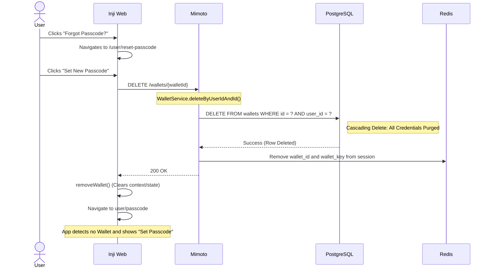

# Wallet Reset Flow (Forgot Passcode)

## 1. Overview

The **Forgot Passcode** flow in Inji Web is implemented as a **Wallet Reset** process. Since the user’s PIN is not stored, the existing Wallet Key cannot be recovered without it, making deletion and re-creation of the wallet the only recovery option.

## 2. Execution Flow

The flow is triggered when the user clicks the **"Forgot Passcode?"** link from the `/user/passcode` screen.

### Phase 1: User Initiation & Warning

1.  **Trigger:** User is on the `/user/passcode` screen and clicks the **"Forgot Passcode?"** link.
2.  **Navigation:** The browser routes to `/user/reset-passcode`.
3.  **Informed Consent:** The UI displays five critical security warnings:
    * Wallet will be securely reset.
    * All stored cards/credentials will be deleted.
    * User must set a brand-new passcode.
    * Cards must be re-downloaded from issuers.
    * This ensures data safety if the device is lost or the session is compromised.

### Phase 2: Destructive Deletion (The API Call)

1.  **User Action:** The user clicks the **"Set New Passcode"** button.
2.  **API Request:** Inji Web triggers `handleForgotPasscode()`, which calls the Mimoto API: `DELETE /wallets/{walletId}`.
3.  **Mimoto Backend Processing:**
    * **Session Validation:** Mimoto ensures the `userId` in the active `HttpSession` matches the owner of the requested `walletId`.
    * **Database Purge:** The `WalletService` invokes `walletRepository.delete()`. Due to database cascading rules, this automatically removes all rows in the `credential` table linked to that `walletId`.
    * **Session Cleanup:** Wallet-related session attributes are cleared (`wallet_id`, `wallet_key`).

### Phase 3: Local State Reset & Re-routing

1.  **UI Cleanup:** Upon receiving a `200 OK`, the React code executes `removeWallet()`. This clears the `walletId` from the local application context and state.
2.  **Navigation:** The user is redirected back to `ROUTES.USER_PASSCODE`.
3.  **Re-onboarding:** Because the backend no longer finds a wallet associated with the `USER_ID`, the user is greeted with the **"Set Passcode"** screen (Onboarding) instead of the "Enter Passcode" screen.

## 3. Architecture

Responsibilities are clearly separated between Inji Web and Mimoto.

* **Inji Web (UI & Orchestration):**
    * Provides the interface for initiating the **Forgot Passcode** flow and displaying security warnings.
    * Triggers the wallet deletion request via API.
    * Manages local application state, including clearing `walletId` and session context after reset.
    * Handles navigation and re-routing for user re-onboarding.

* **Mimoto (Backend & Persistence):**
    * **`WalletsController`**: Exposes the wallet deletion endpoint (`DELETE /wallets/{walletId}`).
    * **`WalletService`**: Validates ownership and orchestrates secure wallet deletion.
    * **Session Store (Redis)**: Maintains the `HttpSession` and clears `wallet_id` and `wallet_key` upon reset.
    * **Persistence Layer (PostgreSQL)**: Stores wallet and user data; wallet deletion triggers cascading removal of all associated credentials.

## 4. Sequence Diagram

## 5. Integration

### API Reference

| API | Method | Stoplight Link                                                                        |
| :--- | :--- |:--------------------------------------------------------------------------------------|
| **Unlock Wallet** | `POST` | `/wallets/{walletId}/unlock`                                            |
| **Delete Wallet** | `DELETE` | `/wallets/{walletId}`                                                 |

For more details on the APIs listed above, visit the [Mimoto Stoplight documentation](https://mosip.stoplight.io/docs/mimoto)

## 6. Security Details

### PIN-Based Cryptography Implication

In this flow, **security at rest is preserved through PIN-based encryption**.

* The user's **PIN is never stored** by the server.
* The **wallet key is derived from the PIN**, and without the correct PIN, the data cannot be decrypted.
* When the wallet is deleted, all encrypted data (including credentials) is permanently removed from the database.

As a result, even if database backups were accessed, the deleted wallet data cannot be meaningfully recovered without the original PIN.

### Session Integrity

The `DELETE` request is **Session Bound**.

* The backend validates the request using the `USER_ID` stored in the session.
* The `walletId` in the request must match the one associated with the session.
* Wallet-related session attributes (`wallet_id`, `wallet_key`) are cleared during deletion.

Additionally, the request requires an `X-XSRF-TOKEN`, protecting against Cross-Site Request Forgery (CSRF).

## 7. Error Handling

### Mimoto API Response Codes

| Status | Error Code | Description                                    |
| :--- | :--- |:-----------------------------------------------|
| **400** | `invalid_request` | Missing Wallet ID or ID mismatch with session. |
| **400** | `wallet_locked` | Wallet is locked or not available in session. |
| **401** | `unauthorized` | Session expired or USER\_ID missing.           |
| **500** | `internal_server_error` | DB connection failure or processing error.     |

### Inji Web UI Behavior

| Scenario | Logic | UI Feedback |
| :--- | :--- | :--- |
| **Success (200)** | Calls `removeWallet()` | Navigates to `/user/passcode` (Onboarding mode). |
| **Failure (4xx/5xx)** | Catch block triggers | Displays `resetFailure` message . |
| **Back Button** | Calls `handleBackNavigation()` | Navigates back to `/user/passcode` (Unlock mode). |

## 8. References

For low-level implementation details of the Mimoto wallet unlock and cryptographic flow, refer to:

* [Mimoto: Wallet Unlock Process](https://github.com/inji/mimoto/blob/master/docs/WalletUnlockProcess.md)
* [Mimoto: User Data Encryption with PIN-Based Key](https://github.com/inji/mimoto/blob/master/docs/UserDataEncryptionWithPinBasedKey.md)

For API documentation, refer to the Mimoto Stoplight:

* [Mimoto API Documentation](https://mosip.stoplight.io/docs/mimoto)