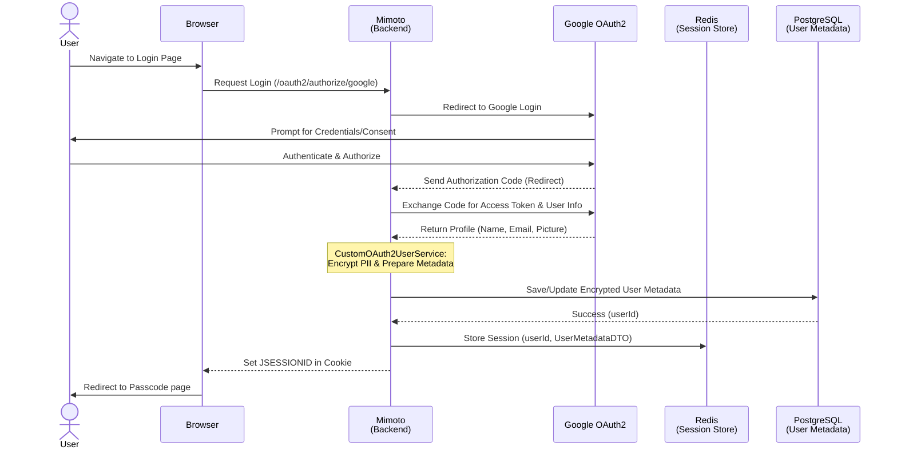

# Google OAuth2 Login & User Onboarding

## 1. Overview
The login flow allows users to log in using their Google account and seamlessly access the application without creating a separate username or password.

When a user logs in:
- Their identity is verified by Google
- The system creates or retrieves an internal user profile
- A secure session is established
- The user is redirected to continue with wallet access (via passcode entry)

The system never stores Google credentials and ensures that all sensitive user data is securely encrypted before being persisted.

This flow in Inji Web utilizes **Spring Security OAuth2** to provide a secure and seamless authentication experience via Google. This process not only authenticates the user but also handles the automatic onboarding of new users by creating persistent metadata and initializing a secure session in Redis.

The flow ensures that Personally Identifiable Information (PII) is protected at rest using encryption, while the user's identity is tied to a unique internal `userId` used for all subsequent wallet operations.

## 2. Prerequisites
To understand the underlying integration and environment setup required for this flow, please refer to the detailed [Mimoto Google OAuth2 Integration Guide](https://github.com/inji/mimoto/blob/master/docs/GoogleOauth2LoginIntegration.md).

**Core requirements include:**
* **OAuth2 Credentials**: Valid Client ID and Secret from the Google Cloud Console.
    * **Guide**: For detailed steps on creating these credentials, refer to the [Inji Web Google Credentials Guide](https://github.com/inji/inji-web/blob/master/docker-compose/README.md#how-to-create-google-client-credentials).
* **Redirect URIs**: Correctly configured callback URLs in both Google Console and Mimoto properties.

## 3. Execution Flow

### Phase 1: Login Initiation
1.  **User Action**: The user clicks the "Continue with Google" button on the Inji Web landing page.
2.  **Redirection**: Inji Web redirects the browser to Mimoto's authorization endpoint: `/oauth2/authorize/google`.
3.  **IdP Handshake**: Mimoto's security filter chain handles the request and redirects the user to Google’s OAuth2 consent screen.

### Phase 2: Authorization & Token Exchange
1.  **Callback**: After account selection, Google redirects back to Mimoto at `/oauth2/callback/google` with an authorization code.
2.  **Token Retrieval**: Spring Security internally exchanges this code for an `access_token` and fetches the user profile (Name, Email, Picture).

### Phase 3: User Onboarding (`CustomOAuth2UserService`)
After successful login, the system checks if the user already exists. If not, it creates a new internal identity and securely stores the user’s profile information.

An internal `userId` is generated to uniquely identify the user within the system, independent of Google. This ensures the system is not tightly coupled to a specific identity provider and can support multiple providers in the future.

1.  **Metadata Check**: The service extracts the Google `sub` ID and checks the `user_metadata` table.
2.  **Creation/Update**: If new, it generates a unique internal **UUID** (`userId`) and encrypts the PII (Name, Email, Picture). Else the existing record is used.
3.  **Enrichment**: The internal `userId` is added to the security principal for downstream use.

### Phase 4: Success/Failure Handling
1.  **Success**: `OAuth2AuthenticationSuccessHandler` saves the `userId` and user metadata into the **HTTPSession** and redirects the user to the passcode page.
2.  **Failure**: `OAuth2AuthenticationFailureHandler` captures errors (timeouts, denied consent), encodes them, and redirects back to the UI with error parameters.

## 4. Architecture
The architecture ensures a clean separation between the user interface, security logic, and data persistence.
Mimoto owns the complete authentication lifecycle, while Inji Web only initiates the login and handles the final response.

* **Inji Web (UI)**: Initiates the login via a simple location replace and handles the final landing page logic. It does not handle passwords or tokens; it only triggers the initial redirect and listens for the final success/failure result.
* **Mimoto (Security & Orchestration)**:
    * **Security Config**: Manages the OAuth2 filter chain and CSRF protection.
    * **User Service**: Handles profile extraction and identity mapping.
    * **Login Handlers**: Manage the final transition back to the UI, whether the attempt succeeded or failed.
* **MOSIP Kernel (Crypto Engine)**: `CryptoManagerService` performs the actual encryption of PII data (email, display name).
* **Session Store (Redis)**: Stores the `JSESSIONID` and its associated data, ensuring high availability and session persistence across server restarts.
* **Persistence Layer (PostgreSQL)**: The persistent database for the `user_metadata` table.

## 5. Sequence Diagram

## 6. Integration
The integration is split into **Authentication** (Spring Security) and **Orchestration** (Mimoto custom services).

* **UI Initiation**: Inji Web triggers login by navigating to the Mimoto `/oauth2/authorize/google` endpoint.
* **Backend Processing**:
    * **Success**: `OAuth2AuthenticationSuccessHandler` redirects the browser to the passcode page.
    * **Failure**: `OAuth2AuthenticationFailureHandler` redirects back to the home page with error details in the URL.

## 7. Security
* **JSESSIONID Protection**: The session cookie is marked as **HttpOnly** and **Secure**, protecting against XSS-based session theft.
* **PII Privacy**: All user metadata (email, display name and profile picture) is encrypted using the MOSIP Kernel's `user_pii` reference key before storage.

## 8. Errors
When login fails, Mimoto uses **302 Redirects** to pass error context back to Inji Web.

| Scenario | HTTP Status | Description                                                                                      |
| :--- | :--- |:-------------------------------------------------------------------------------------------------|
| **Login Success** | 302 | Redirects to `${mosip.inji.web.url}/user/passcode`.                                              |
| **Consent Denied** | 302 | Redirects to `${injiWebUrl}/?status=error&error_message=Consent denied...`.                      |
| **IDP Timeout** | 302 | Redirects to `${injiWebUrl}/?status=error&error_message=Timeout...`. Google servers unreachable. |
| **Unauthorized** | 401 | Returned if a user attempts to access protected APIs without an active session.                  |

## 9. References
* [How to create Google Client Credentials](https://github.com/inji/inji-web/blob/develop/docker-compose/README.md#how-to-create-google-client-credentials)
* [Google OAuth2 Login Integration](https://github.com/inji/mimoto/blob/master/docs/GoogleOauth2LoginIntegration.md)