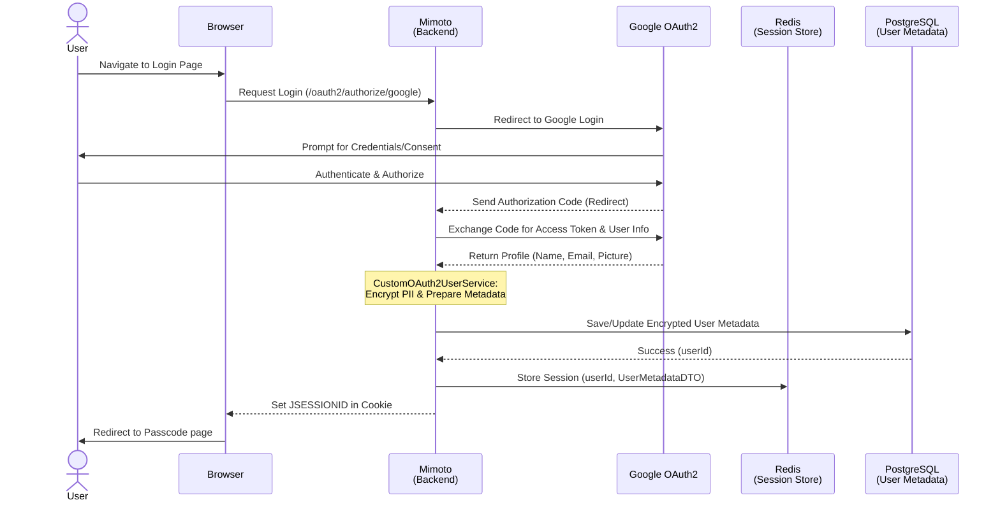

# OAuth2 Login & User Onboarding

## 1. Overview
The login flow allows users to log in using an **Identity Provider (IDP)** account and seamlessly access the application without creating a separate username or password.

> **Note:** The current implementation uses **Google** as the default Identity Provider.

When a user logs in:
- Their identity is verified by the Identity Provider.
- The system creates or retrieves an internal user profile.
- A secure session is established.
- The user is redirected to continue with wallet access (via passcode entry).

The system never stores IDP credentials and ensures that all sensitive user data is securely encrypted before being persisted.

This flow in Inji Web utilizes **Spring Security OAuth2** to provide a secure and seamless authentication experience. This process not only authenticates the user but also handles the automatic onboarding of new users by creating persistent metadata and initializing a secure session in Redis.

The flow ensures that Personally Identifiable Information (PII) is protected at rest using encryption, while the user's identity is tied to a unique internal `userId` used for all subsequent wallet operations.

## 2. Prerequisites
To understand the underlying integration and environment setup required for this flow, please refer to the detailed [Mimoto OAuth2 Integration Guide](https://github.com/inji/mimoto/blob/master/docs/GoogleOauth2LoginIntegration.md).

**Core requirements include:**
* **OAuth2 Credentials**: Valid Client ID and Secret from your IDP (e.g., Google Cloud Console).
    * **Current Implementation**: For detailed steps on creating Google credentials, refer to the [Inji Web Google Credentials Guide](https://github.com/inji/inji-web/blob/master/docker-compose/README.md#how-to-create-google-client-credentials).
* **Redirect URIs**: Correctly configured callback URLs in both the IDP Console and Mimoto properties.

## 3. Execution Flow

### Phase 1: Login Initiation
1.  **User Action**: The user clicks the "Continue with [Provider]" button on the Inji Web landing page.
2.  **Redirection**: Inji Web redirects the browser to Mimoto's authorization endpoint.
3.  **IdP Handshake**: Mimoto's security filter chain handles the request and redirects the user to the IDP's consent screen.

### Phase 2: Authorization & Token Exchange
1.  **Callback**: After account selection, the IDP redirects back to Mimoto with an authorization code.
2.  **Token Retrieval**: Spring Security internally exchanges this code for an `access_token` and fetches the user profile (Name, Email, Picture).

### Phase 3: User Onboarding
After successful login, the system checks if the user already exists. If not, it creates a new internal identity and securely stores the user’s profile information.

An internal `userId` is generated to uniquely identify the user within the system. This ensures the system is not tightly coupled to a specific identity provider and can support multiple providers in the future.

1.  **Metadata Check**: Mimoto checks the `user_metadata` table.
2.  **Creation/Update**: If new, it generates a unique internal **UUID** (`userId`) and encrypts the PII (Name, Email, Picture). Else the existing record is used.
3.  **Enrichment**: The internal `userId` is added to the security principal for downstream use.

### Phase 4: Success/Failure Handling
1.  **Success**: Mimoto saves the `userId` and user metadata into the **HTTPSession** and redirects the user to the passcode page.
2.  **Failure**: Mimoto captures errors (timeouts, denied consent), encodes them, and redirects back to the UI with error parameters.

## 4. Architecture
The architecture ensures a clean separation between the user interface, security logic, and data persistence.
Mimoto owns the complete authentication lifecycle, while Inji Web only initiates the login and handles the final response.

* **Inji Web (UI)**: Initiates the login via a simple location replace and handles the final landing page logic. It does not handle passwords or tokens; it only triggers the initial redirect and listens for the final success/failure result.
* **Mimoto (Security & Orchestration)**:
    * **Security Config**: Manages the OAuth2 filter chain and CSRF protection.
    * **User Service**: Handles profile extraction and identity mapping.
    * **Login Handlers**: Manage the final transition back to the UI, whether the attempt succeeded or failed.
* **MOSIP Kernel (Crypto Engine)**: `CryptoManagerService` performs the actual encryption of PII data (email, display name).
* **Session Store (Redis)**: Stores the `JSESSIONID` and its associated data, ensuring high availability and session persistence across server restarts.
* **Persistence Layer (PostgreSQL)**: The persistent database for the `user_metadata` table.

## 5. Sequence Diagram

## 6. Configuration & Switching Providers
If you want to change your IDP from Google to another provider, you need to update the following properties.

**Important:** When switching, you should replace the word `google` in the property keys with your new provider's **Registration ID** (e.g., `okta`, `facebook`, or `keycloak`). Refer `application-default.properties` for the property keys.

### A. Client Registration (in `application-default.properties`)
These properties identify the application to the IDP:
* `spring.security.oauth2.client.registration.{registrationId}.client-id` – Client ID from your new provider.
* `spring.security.oauth2.client.registration.{registrationId}.client-secret` – Client secret from your new provider.
* `spring.security.oauth2.client.registration.{registrationId}.scope` – Scopes supported (e.g., `profile, email`).
* `spring.security.oauth2.client.registration.{registrationId}.client-name` – Human-readable name for the login button.

### B. Provider Endpoints (in `application-default.properties`)
These tell Mimoto where to send the user for authentication:
* `spring.security.oauth2.client.provider.{registrationId}.authorization-uri` – The provider's login URL.
* `spring.security.oauth2.client.provider.{registrationId}.token-uri` – The URL to exchange codes for tokens.
* `spring.security.oauth2.client.provider.{registrationId}.user-info-uri` – The URL to fetch user profile details.
* `spring.security.oauth2.client.provider.{registrationId}.jwk-set-uri` – The URI for the provider's public keys to validate tokens.

### C. Attribute Mappings (in `application-default.properties`)
These map the IDP's response fields to Inji’s internal metadata:
* `spring.security.oauth2.client.provider.{registrationId}.userNameAttribute` – The unique identifier (e.g., `sub`).
* `spring.security.oauth2.client.provider.{registrationId}.nameAttribute` – Field for the user's full name.
* `spring.security.oauth2.client.provider.{registrationId}.emailAttribute` – Field for the user's email.
* `spring.security.oauth2.client.provider.{registrationId}.pictureAttribute` – Field for the profile picture URL.

### D. Global Properties (in `application.properties`)
* `googleIdToken` – Update this URL to point to the new provider's token endpoint

## 7. Security
* **JSESSIONID Protection**: The session cookie is marked as **HttpOnly** and **Secure**, protecting against XSS-based session theft.
* **PII Privacy**: All user metadata (email, display name and profile picture) is encrypted before storage.

## 8. Errors
When login fails, Mimoto uses **302 Redirects** to pass error context back to Inji Web.
Direct requests to protected APIs made without a valid session will return a standard 401 Unauthorized response.

| Scenario | HTTP Status | Description                                                                            |
| :--- | :--- |:---------------------------------------------------------------------------------------|
| **Login Success** | 302 | Redirects to `${mosip.inji.web.url}/user/passcode`.                                    |
| **Consent Denied** | 302 | Redirects to `${injiWebUrl}/?status=error&error_message=...`.                          |
| **IDP Timeout** | 302 | Redirects to `${injiWebUrl}/?status=error&error_message=...`. IDP servers unreachable. |
| **Unauthorized** | 401 | Returned if a user attempts to access protected APIs without an active session.        |

## 9. References
* [How to create Google Client Credentials](https://github.com/inji/inji-web/blob/master/docker-compose/README.md#how-to-create-google-client-credentials)
* [Google OAuth2 Login Integration](https://github.com/inji/mimoto/blob/master/docs/GoogleOauth2LoginIntegration.md)