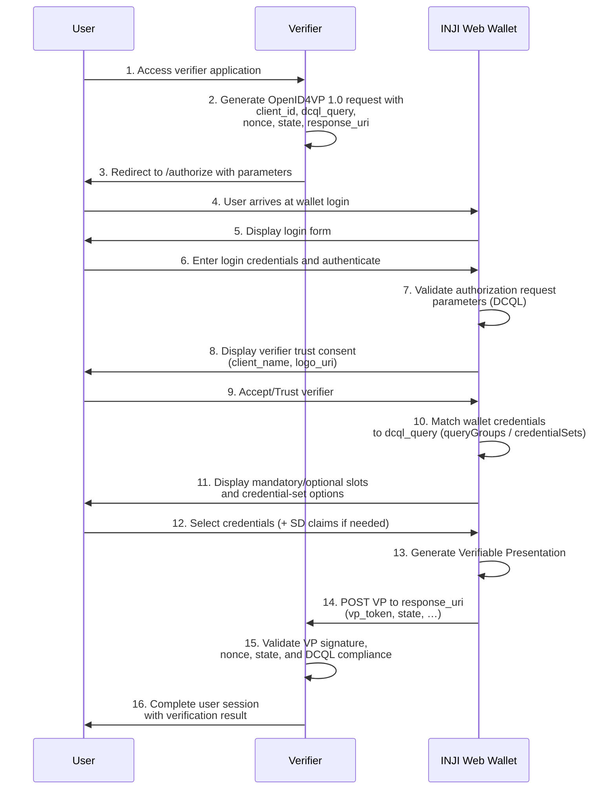
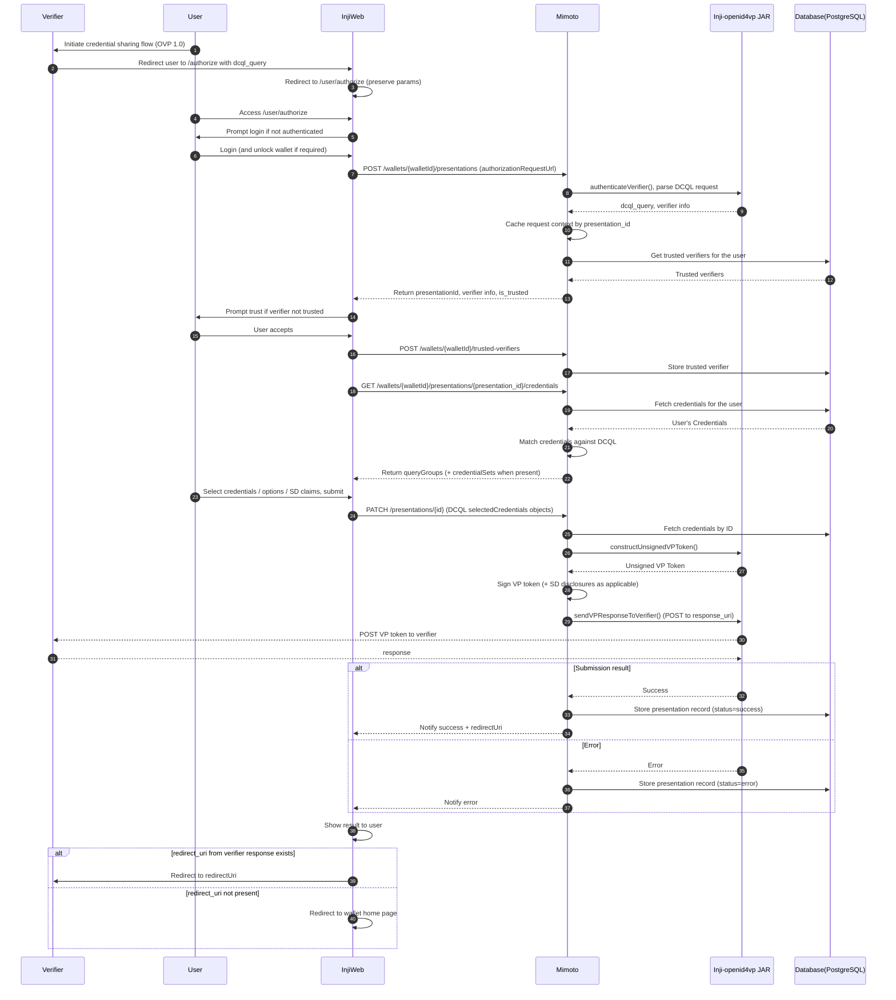
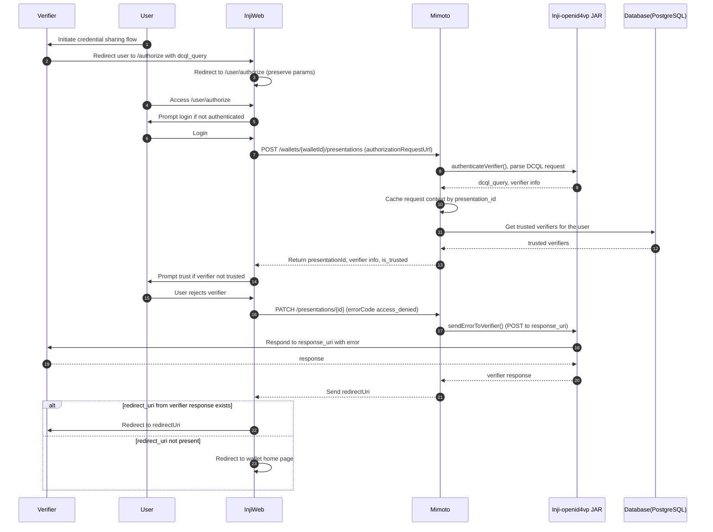

# Integrator’s Guide – Web Wallet Login & VC Sharing (OpenID4VP 1.0 / DCQL)

> **Spec version:** This guide covers the **OpenID4VP 1.0** flow that uses **DCQL** (Digital Credentials Query Language) via `dcql_query`.
>
> For the older **OpenID4VP Draft-23** / Presentation Exchange flow (`presentation_definition`), see [OpenID4VP Draft-23 Integration Guide](./OpenID4VPDraft23IntegrationGuide.md).

## 1. Introduction
This guide provides implementers (*Verifiers*) with the information needed to integrate with the **INJI Web Wallet** when requesting credentials using **OpenID for Verifiable Presentations 1.0**.

In OpenID4VP 1.0, the verifier expresses credential requirements with a **DCQL query**. The wallet authenticates the user, shows trust and consent screens, lets the user satisfy the DCQL query (including optional **credential sets** / OR options), and returns a Verifiable Presentation (VP) to the verifier’s `response_uri`.

**Supported Credential Formats** (for presentation):
- **W3C JSON-LD** Verifiable Credentials (Data Model 1.1 / `ldp_vc`)
- **IETF SD-JWT VC** (`dc+sd-jwt`), including selective disclosure where applicable. `vc+sd-jwt` is accepted only as a legacy / compatibility alias.

> **Technical API contracts** (Mimoto presentation endpoints, `queryGroups` / `credentialSets` response shapes, submit payload rules): see [OpenID4VP 1.0 support in Inji Web Wallet (Mimoto)](https://github.com/inji/mimoto/blob/develop/docs/OVP-1.0-Support.md).

## 2. High-Level Flow
1. Verifier constructs an OpenID4VP 1.0 authorization request with a `dcql_query`.
2. User is redirected to the INJI Web Wallet (`/authorize`).
3. User logs in (and unlocks the wallet if required).
4. User reviews verifier details and gives trust consent.
5. Wallet loads matching credentials for each DCQL credential query (`queryGroups`), optionally grouped by `credentialSets`.
6. User selects credentials (and SD claims when applicable) according to required / optional rules.
7. Wallet generates a Verifiable Presentation and POSTs it to the verifier’s `response_uri`.
8. User is redirected back to the verifier when a `redirectUri` is returned.

### Sequence Diagram



## 3. Authorization Endpoint
All verifier integrations begin by redirecting the user to:

```bash
https://example.injiweb.com/authorize
```

### Required URL Parameters

| Parameter | Required | Description |
|----------|----------|-------------|
| `client_id` | Yes | Verifier identifier. OpenID4VP 1.0 encodes how to interpret it with a **Client Identifier Prefix** inside the value (`prefix:orig_client_id`). An unprefixed value is treated as **pre-registered**. Examples: `redirect_uri:https://verifier.example.com/cb`, `decentralized_identifier:did:example:123`, or `sample-app` (pre-registered). |
| `dcql_query` | Yes* | URL-encoded DCQL query describing required credentials, claims, and optional `credential_sets`. *Either `dcql_query` or a `scope` that represents a DCQL query must be present (not both), per OpenID4VP 1.0. |
| `response_type` | Yes | Must be `vp_token`. |
| `response_mode` | Yes | Must be `direct_post` or `direct_post.jwt`. |
| `nonce` | Yes | Cryptographically secure random value for replay protection. |
| `state` | Yes | Opaque value maintained across request/response. |
| `response_uri` | Yes | HTTPS endpoint at the verifier that receives the VP (required for `direct_post`). |
| `client_metadata` | No | URL-encoded metadata that describes verifier branding and supported formats. |

> Do **not** send `presentation_definition` / `presentation_definition_uri` for an OpenID4VP 1.0 DCQL request. Those parameters belong to the [Draft-23 Presentation Exchange](./OpenID4VPDraft23IntegrationGuide.md) flow.
>
> Do **not** send `client_id_scheme`. That parameter belongs to older drafts (including the [Draft-23 guide](./OpenID4VPDraft23IntegrationGuide.md)). In OpenID4VP 1.0, the scheme is conveyed only via the prefix in `client_id`.

## 4. Client Identifier Prefixes

OpenID4VP 1.0 uses Client Identifier Prefixes in `client_id` (`<prefix>:<orig_client_id>`). If there is no recognized prefix (no `:` with a supported prefix before it), the wallet treats `client_id` as a **pre-registered** client.

### 4.1 `redirect_uri`
- No prior registration needed.
- Example: `client_id=redirect_uri:https://verifier.example.com/cb`
- Wallet identifies the verifier from the URI after the prefix (typically aligned with `response_uri` for `direct_post`).
- Verifier metadata MUST be passed via `client_metadata`.

### 4.2 Pre-registered (unprefixed)
- `client_id` and metadata must be pre-registered with the wallet operator.
- Example:
  ```bash
  client_id=sample-app
  ```
- Do not add a `pre-registered:` prefix; the absence of a prefix is the pre-registered case.

### 4.3 `decentralized_identifier`
- Example: `client_id=decentralized_identifier:did:example:123`
- The authorization request MUST be signed with a private key associated with the DID.
- Wallet resolves the DID document to obtain the public key and verify the request signature.
- Verifier metadata (other than the public key) MUST be passed via `client_metadata`.

> In [Draft-23](./OpenID4VPDraft23IntegrationGuide.md), DID-based verifiers use `client_id_scheme=did` with an unprefixed `client_id` (for example, `did:example:123`). That pattern does not apply to OpenID4VP 1.0.

## 5. DCQL Query
The `dcql_query` parameter defines what credentials (and optionally which claims / claim combinations) the verifier is requesting.

### Example DCQL query (decoded) — independent required credentials

```json
{
  "credentials": [
    {
      "id": "pid_query",
      "format": "ldp_vc",
      "meta": {
        "type_values": [["NationalID"]]
      },
      "claims": [
        { "path": ["name"] },
        { "path": ["dateOfBirth"] }
      ]
    },
    {
      "id": "mdl_query",
      "format": "ldp_vc",
      "meta": {
        "type_values": [["DrivingLicense"]]
      },
      "claims": [
        { "path": ["licenseNumber"] }
      ]
    }
  ]
}
```

When the verifier omits `credential_sets`, each credential query is treated as an independent **mandatory** slot.

### Example — `credential_sets` (OR options)

Verifier accepts **PAN OR Aadhaar OR (Voter ID AND Driving License)**:

```json
{
  "credentials": [
    { "id": "pan", "format": "ldp_vc", "meta": { "type_values": [["PAN"]] } },
    { "id": "aadhaar", "format": "ldp_vc", "meta": { "type_values": [["Aadhaar"]] } },
    { "id": "voter_id", "format": "ldp_vc", "meta": { "type_values": [["VoterID"]] } },
    { "id": "dl", "format": "ldp_vc", "meta": { "type_values": [["DrivingLicense"]] } }
  ],
  "credential_sets": [
    {
      "required": true,
      "options": [
        ["pan"],
        ["aadhaar"],
        ["voter_id", "dl"]
      ]
    }
  ]
}
```

Interpretation:
- **OR** between options in `credential_sets[].options`
- **AND** within a single option (for example `["voter_id", "dl"]`)

For Mimoto’s wallet-facing response model (`queryGroups`, `credentialSets`) and field reference, see the [Mimoto OVP 1.0 support doc](https://github.com/inji/mimoto/blob/develop/docs/OVP-1.0-Support.md#step-2--get-matching-credentials-get).

## 6. Client Metadata
Client metadata provides verifier branding information (such as name and logo) displayed during the consent step, along with the supported VP formats the verifier can process.

### Example (decoded)

```json
{
  "client_name": "Sample Application",
  "logo_uri": "https://mosip.github.io/inji-config/logos/StayProtectedInsurance.png",
  "vp_formats_supported": {
    "ldp_vc": {
      "proof_type": [
        "Ed25519Signature2018",
        "Ed25519Signature2020",
        "RsaSignature2018"
      ]
    },
    "dc+sd-jwt": {
      "sd-jwt_alg_values": ["ES256"],
      "kb-jwt_alg_values": ["ES256"]
    }
  }
}
```

> Use `dc+sd-jwt` as the canonical SD-JWT VC format key in metadata. `vc+sd-jwt` may appear only as a legacy / compatibility alias during transition.
>
> Metadata field names may vary by library version (`vp_formats` vs `vp_formats_supported`). Use the formats your verifier stack and Mimoto deployment expect.

## 7. Sample Complete Authorization Request

```bash
https://example.injiweb.com/authorize
  ?client_id=sample-app
  &dcql_query=<URL-ENCODED JSON>
  &response_type=vp_token
  &response_mode=direct_post
  &nonce=T8L8YdEg_cBkKSB1m0QoBw
  &state=req_68af3c2d-6424-44ee-b3f8-01585e487d6c
  &response_uri=https://verifier.example.com/vp-submission
  &client_metadata=<URL-ENCODED JSON>
```

Pre-registered example above uses an unprefixed `client_id`. For `redirect_uri` prefix:

```bash
https://example.injiweb.com/authorize
  ?client_id=redirect_uri%3Ahttps%3A%2F%2Fverifier.example.com%2Fcb
  &dcql_query=<URL-ENCODED JSON>
  &response_type=vp_token
  &response_mode=direct_post
  &nonce=T8L8YdEg_cBkKSB1m0QoBw
  &state=req_68af3c2d-6424-44ee-b3f8-01585e487d6c
  &response_uri=https://verifier.example.com/vp-submission
  &client_metadata=<URL-ENCODED JSON>
```

## 8. User Experience in the Wallet

### 8.1 Login
User logs into the wallet using their credentials and unlocks the wallet when required.

### 8.2 Verifier Trust Consent
The wallet displays:
- `client_name`
- `logo_uri`

The user may accept trust or cancel / reject the request.

### 8.3 Credential Selection (DCQL UI)
After trust is accepted, the wallet calls Mimoto and renders based on the GET credentials response:

| GET /credentials shape | Wallet UI behaviour |
|------------------------|---------------------|
| `queryGroups` present, `credentialSets` empty | One **mandatory** slot per query; submit enabled when every slot has a selection; respect `multiple` within a slot |
| `credentialSets` non-empty | Sections for required / optional sets; user picks **one option** per required set; options that list multiple `queryId`s require all slots in that option |
| `availableCredentials` only (no `queryGroups`) | Draft-23 PE mode — see [Draft-23 guide](./OpenID4VPDraft23IntegrationGuide.md) |

Additional UX behaviour:
- Mandatory vs optional sections and requirement info for the verifier’s request
- Instruction banners (for example “select one option”, “select all required cards”)
- For SD-JWT, selectively disclosable claims can be reviewed; always-disclosed claims remain shared
- If the request cannot be satisfied at all (no credentials for required queries / required credential sets), the wallet shows a no-match state; the user may still reject the verifier
- If some query groups are empty but a required `credential_sets` option remains satisfiable (OR alternatives), the wallet does **not** show the no-match popup and lets the user select and share

### 8.4 VP Generation
Wallet / Mimoto constructs and signs the VP for the selected credentials (and SD disclosures when provided).

### 8.5 VP Submission
Wallet sends the VP to the verifier’s `response_uri`, then redirects the user to the returned `redirectUri` when present.

## 9. VP Delivery

### POST Request Format
Wallet POSTs form-encoded data to the `response_uri`.

### 9.1 For response_mode `direct_post`

| Field | Description |
|-------|-------------|
| `vp_token` | The Verifiable Presentation(s) returned for the DCQL query. |
| `state` | Same value received in the authorization request. |

Unlike Presentation Exchange (Draft-23), OpenID4VP 1.0 DCQL responses do **not** use a `presentation_submission` object.

### Example

```bash
POST /vp-submission
Content-Type: application/x-www-form-urlencoded

vp_token=<vp_token_value>
state=req_68af3c2d-6424-44ee-b3f8-01585e487d6c
```

### 9.2 For response_mode `direct_post.jwt`

| Field | Description |
|-------|-------------|
| `response` | JWT (or JWE) containing the authorization response parameters such as `vp_token` and `state`. |

```bash
POST /vp-submission
Content-Type: application/x-www-form-urlencoded

response=<encrypted_or_jwt_authorization_response>
```

## 10. Security Considerations

### Nonce Validation
Verifier must ensure:
- VP / presentation binding uses the same nonce
- Nonce is unexpired
- Nonce is single-use

### State Validation
Verifier must validate `state` to correlate the response with the correct session.

### Selection rules (enforced by Mimoto)
- Submit credential IDs must come from the prior GET /credentials session cache
- Each submit object must include the correct `queryId`
- `multiple=false` allows at most one credential per query
- Required `credential_sets` must match exactly one option

Details: [Mimoto OVP 1.0 support — Step 3](https://github.com/inji/mimoto/blob/develop/docs/OVP-1.0-Support.md#step-3--submit-or-reject-patch).

## 11. Integration Steps for Verifiers

1. Choose your Client Identifier Prefix approach (or an unprefixed pre-registered `client_id`).
2. Prepare a valid `dcql_query` (credentials, optional claims / claim_sets, optional credential_sets).
3. Prepare a `client_metadata` object.
4. Generate `state` and `nonce`.
5. Implement a secure `response_uri` endpoint.
6. Redirect the user to the `/authorize` endpoint with all parameters.
7. Receive the VP via direct POST.
8. Validate:
   - VP signature / holder binding (as required)
   - Credential format
   - Nonce and state
   - That returned presentations satisfy the DCQL query
9. Perform your internal verification and decisioning.

## 12. Error Handling

Possible errors returned to the verifier (non-exhaustive):

| Error code | Reason |
|-------|-------------|
| `invalid_request` | Invalid or missing parameters (including malformed `dcql_query`) |
| `access_denied` | User cancelled, no matching credentials, or denied consent |

Refer to the OpenID4VP 1.0 specification for the full error model: [OpenID4VP 1.0 — Error Response](https://openid.net/specs/openid-4-verifiable-presentations-1_0.html).

Sample error:

```json
{
  "error": "access_denied",
  "error_description": "User denied authorization to share credentials",
  "state": "K5J1chFRHMAbbT90FxUq2Q=="
}
```

Wallet ↔ Mimoto validation errors on submit (unknown `queryId`, invalid credential-set option, mixed `selectedCredentials` types, etc.) are documented in [Mimoto OVP 1.0 — Common errors](https://github.com/inji/mimoto/blob/develop/docs/OVP-1.0-Support.md#common-errors-400).

## 13. Technical Specification

* **Key actors:** Verifier, User, INJI Web (wallet UI), Mimoto (wallet backend), Inji-openid4vp JAR, PostgreSQL Database.
* The **Verifier** redirects the **User** to INJI Web’s **/authorize** endpoint with OpenID4VP 1.0 parameters (`dcql_query`).
* **INJI Web** handles login, unlock, and trust prompts, then calls Mimoto’s wallet presentation APIs.
* **Mimoto** receives the request through **POST /wallets/{walletId}/presentations**, authenticates the verifier, detects **DCQL vs Presentation Exchange**, and caches the presentation context.
* INJI Web fetches credential options via **GET /wallets/{walletId}/presentations/{presentationId}/credentials**.
  * DCQL → `queryGroups` (+ optional `credentialSets`)
  * Draft-23 → flat `availableCredentials`
* When the user submits, InjiWeb calls **PATCH /wallets/{walletId}/presentations/{presentationId}** with DCQL selection objects:
  `{ queryId, selectedCredentialIds, selectedSdClaims? }[]`
* **Mimoto** constructs and signs the VP token, then sends it to the verifier’s **response_uri**.
* Mimoto stores success/error status in the **Database** based on the verifier’s response.
* If the user rejects, InjiWeb issues a PATCH error update, and Mimoto notifies the verifier accordingly.

### Wallet ↔ Mimoto API (authoritative)

For request/response JSON, UI rendering rules, SD-JWT `selectedSdClaims` behaviour, rejection payloads, and Draft-23 appendix shapes, use:

**[OpenID4VP 1.0 support in Inji Web Wallet (Mimoto)](https://github.com/inji/mimoto/blob/develop/docs/OVP-1.0-Support.md)**

### Detecting OVP 1.0 vs Draft-23 in the wallet

| GET /credentials response | Meaning |
|---------------------------|---------|
| `queryGroups` is present | OVP 1.0 / DCQL |
| `availableCredentials` is present (no `queryGroups`) | Draft-23 Presentation Exchange |

Do not mix string credential IDs and DCQL selection objects in the same `selectedCredentials` array.

### Detailed Integration Flow



### User Rejects Verifier Flow



## References

- [OpenID for Verifiable Presentations 1.0](https://openid.net/specs/openid-4-verifiable-presentations-1_0.html)
- [OpenID4VP 1.0 support in Inji Web Wallet (Mimoto) — API & UI contracts](https://github.com/inji/mimoto/blob/develop/docs/OVP-1.0-Support.md)
- [OpenID4VP Draft-23 / Presentation Exchange Integration Guide (Inji Web)](./OpenID4VPDraft23IntegrationGuide.md)
- [OpenID4VP SD-JWT support (Inji Web)](./SDJWTOpenID4VPIntegrationGuide.md)
- [INJI OpenID4VP jar ReadMe](https://github.com/mosip/inji-openid4vp/blob/master/README.md)
- [Mimoto API Documentation](https://mosip.stoplight.io/docs/mimoto)
