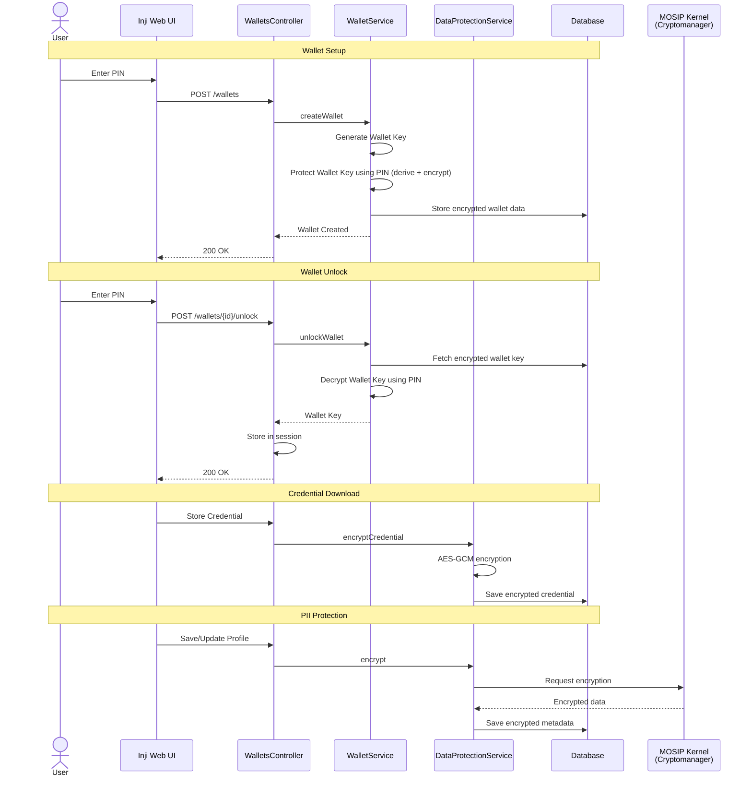

# User Data Encryption & PIN-Based Key Protection

## 1. Overview

The user's sensitive data is protected using a layered encryption model designed to ensure that sensitive information is never stored in plaintext. This mechanism ensures that Verifiable Credentials (VCs) and Personally Identifiable Information (PII) are never stored in plaintext. The core of this security is the **Wallet Key** - a master AES-256 key that is itself encrypted using a **Derived Key** generated from the user's **6-digit PIN**.

The primary goals are:

* Ensuring confidentiality of all sensitive data
* Protecting the Wallet Key through PIN-based encryption
* Securing data even if the database is compromised

## 2. Execution Flow

### Phase 1: PIN Creation & Wallet Key Generation

When a user sets a PIN, the system generates a secret **Wallet Key** and securely locks it using that PIN. The PIN itself is never stored — only a derived cryptographic key is used.
When the PIN is set for the first time:

1.  **Wallet Key Generation:** Mimoto generates a random 256-bit AES symmetric key (the **Wallet Key**).
2.  **Key Derivation (PBKDF2):** Mimoto takes the user's PIN and a random 32-byte salt to derive a **Derived Key** using the `PBKDF2WithHmacSHA512` algorithm.
3.  **Master Encryption:** The Wallet Key is encrypted with this Derived Key using `AES/GCM/NoPadding`.
4.  **Storage:** The resulting encrypted `wallet_key`(containing the Salt, IV, and Ciphertext) is stored in the `wallet` table.

### Phase 2: Unlocking the Wallet

When the user enters their PIN during login or session resumption, the system regenerates the same Derived Key and uses it to unlock (decrypt) the stored Wallet Key:

1.  **Re-Derivation:** Mimoto retrieves the salt from the database and derives the key again using the entered PIN.
2.  **Decryption:** The Derived Key is used to decrypt the stored payload to retrieve the Wallet Key (Base64-encoded AES Key).
3.  **Memory Storage:** The Wallet Key is stored in the **HTTPSession** to facilitate data access without re-prompting the user for the PIN.

### Phase 3: Credential and PII Encryption

Once the Wallet Key is available in the session:

1.  **Credential Protection:** Every Verifiable Credential downloaded is encrypted using the Wallet Key before being saved to the `wallet_credentials` table.
2.  **PII Protection:** User metadata (such as name, email and profile picture) is stored in the `user_metadata` table. These fields are encrypted using a System Key (Reference ID: `user_pii`) managed via the MOSIP Kernel Cryptomanager, rather than the user's Wallet Key.

## 3. Architecture

Responsibilities are clearly separated between Inji Web and Mimoto.

* **Inji Web (UI & Orchestration):** 
    * Provides the interface for PIN setup and entry.
    * Initiates wallet creation and unlock requests
    * Maintains the authenticated session with Mimoto.
    * Does not perform cryptographic operations; it acts as the gateway to the user.
* **Mimoto (Crypto & Storage):**
    * **`DerivedKeyCryptoUtil`**: Handles the core PBKDF2 key derivation and AES-GCM decryption for the Wallet Key.
    * **`DataProtectionService`**: Manages the local encryption/decryption of credentials using the session-based Wallet Key and orchestrates PII encryption via the Cryptomanager.
    * **`UserMetadataService`**: Handles the lifecycle of PII attributes (name, email and profile picture) and ensures they are encrypted before persistence.
    * **`WalletRepository` & `WalletCredentialsRepository`**: Persistence layers for encrypted key metadata and user's verifiable credentials.

## 4. Sequence Diagram: Secure Data Access

## 5. Integration

### API Reference

| API | Method | Stoplight Link                        |
| :--- | :--- |:--------------------------------------|
| **Unlock Wallet** | `POST` | [/wallets/{id}/unlock](<to be added>) |
| **User Metadata** | `GET` | [/users/metadata](<to be added>)      |

## 6. Security Specifications
Mimoto adheres to the following cryptographic standards to ensure security for the user data:

* **Algorithm:** AES-256 in GCM mode (`AES/GCM/NoPadding`).
* **Integrity:** GCM provides a 128-bit authentication tag to detect any tampering with the encrypted data.
* **Key Stretching:** PBKDF2 with **10,000 iterations** (configured via `mosip.kernel.crypto.hash-iteration`) to prevent brute-forcing of the 6-digit PIN. This property is defined in the `application-default.properties` file for the local setup, and in the `mimoto-default.properties` file for the environment setup.
* **Randomness:** Unique **32-byte salts** and **12-byte IVs** (Nonces) are generated for every encryption operation using `SecureRandom`.

## 7. Errors

Mimoto returns specific error codes if the encryption/decryption process fails:

| Error Code | HTTP Status | Description                                                                                 |
| :--- | :--- |:--------------------------------------------------------------------------------------------|
| invalid_request | 400 | Validation failure: Missing Wallet ID or User ID or wallet key. invalid 6-digit PIN format. |
| invalid_pin | 400 | Incorrect PIN: Decryption of wallet_key failed; retries still available.                    |
| unauthorized | 401 | Session expired: User ID not found in session.                                              |
| internal_server_error | 500 | Processing error during decryption or cryptomanager operation.                              |
| database_unavailable | 503 | Database unavailable: Unable to fetch or update required data.                              |

## 8. References

For low-level implementation details of the Mimoto cryptographic layer, refer to:

* [Mimoto: User Data Encryption with PIN-Based Key](https://github.com/mosip/mimoto/blob/main/docs/UserDataEncryptionWithPinBasedKey.md)
* [Mimoto: Wallet Unlock Process](https://github.com/mosip/mimoto/blob/main/docs/WalletUnlockProcess.md)

For api documentation, refer to the Mimoto Stoplight:
* [Mimoto API Documentation](https://mosip.stoplight.io/docs/mimoto)