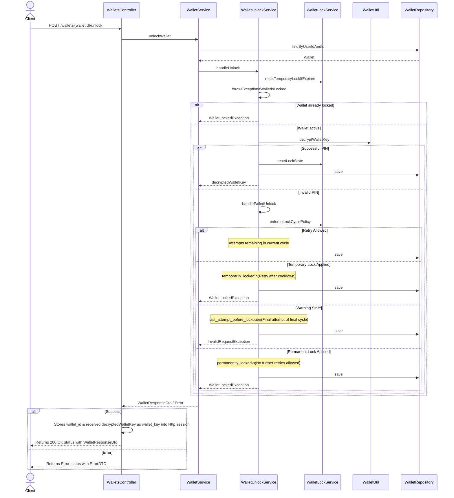

# Wallet Unlock Flow & Lockout Policy

## 1. Overview

The Wallet Unlock flow in Inji Web is a PIN-based authentication mechanism that enables secure access to the user's wallet by decrypting the wallet key. Since Inji Web does not store the user's password in plain text, the provided PIN is used to derive the decryption key. To protect against unauthorized access and brute-force attacks, the system enforces a lockout policy that transitions the wallet through specific security states defined in `WalletLockStatus`: `TEMPORARILY_LOCKED`, `PERMANENTLY_LOCKED`, `LAST_ATTEMPT_BEFORE_LOCKOUT`, and `LOCK_EXPIRED`.

The lockout policy enforces the following wallet states:

* **TEMPORARILY_LOCKED:** The wallet is locked for a configured duration after exceeding allowed attempts in a cycle.
* **LOCK_EXPIRED:** A previously applied temporary lock has expired, allowing the user to retry PIN entry.
* **LAST_ATTEMPT_BEFORE_LOCKOUT:** Indicates the final remaining retry attempt before the wallet transitions to a permanent lock.
* **PERMANENTLY_LOCKED:** The wallet is permanently disabled after exceeding the maximum number of lock cycles.

## 2. Execution Flow

The flow is triggered whenever a user is prompted for their passcode (e.g., after session expiry or initial login).

1.  **Input:** User enters a 6-digit PIN on the Inji Web Passcode page.
2.  **Authentication & Decryption:** Inji Web calls the Mimoto `/unlock` API. Mimoto attempts to decrypt the `wallet_key` using the provided PIN.
3.  **State Management:**
    * **Success:** Wallet is successfully unlocked. `WalletLockService` resets all failure counters and lock metadata (clearing failed attempts, cycle counts, and active lock statuses). The user is then redirected to the home page.
    * **Failure:** Mimoto increments the `failedAttemptCount`. If the count reaches defined thresholds, the `walletLockStatus` is updated to a restricted state. The user is prompted to re-enter the PIN, subject to the current lock status.
4.  **Locking Tiers:**    
    * **Temporary Lock (`temporarily_locked`):** The wallet is unusable for a configured duration (e.g., 60 mins).
    * **Warning (`last_attempt_before_lockout`):** Triggered when the user is on their final attempt of the final allowed cycle.
    * **Permanent Lock (`permanently_locked`):** After exceeding the maximum allowed lock cycles, the wallet is permanently disabled.

## 3. Architecture

The architecture splits responsibilities to ensure that sensitive cryptographic operations and state management are isolated from the UI.

* **Inji Web:**
    * **UI:** Captures user PIN.
    * **Session Management:** Once unlocked, it stores the received `decryptedWalletKey` into the Http session.
* **Mimoto:**
    * **WalletUnlockService:** Orchestrates the high-level unlock logic, including checking for expired locks via `resetTemporaryLockIfExpired`.
    * **WalletLockService:** Enforces the "Lock Cycle Policy" (failed attempt increments and cycle management).
    * **WalletUtil:** Performs AES-based decryption of the wallet key using a key derived from the provided PIN.
    * **Database (WalletRepository):** Persists the wallet object with its encryption and lock metadata.

## 4. Sequence Diagram

The sequence diagram below shows the wallet unlock flow, highlighting PIN validation and the progression of lock states across retries.

## 5. Integration

### API Reference

| Action | Endpoint | Documentation                                                                                      |
| :--- | :--- |:---------------------------------------------------------------------------------------------------|
| **Unlock Wallet** | `POST /wallets/{walletId}/unlock` | [Mimoto Stoplight](https://mosip.stoplight.io/docs/mimoto) |

## 6. Security & Configuration

Configurable properties governing the passcode flow are defined in the `application-default.properties` file for the local setup, and in the `mimoto-default.properties` file for the environment setup.

| Property | Default | Description |
| :--- | :--- | :--- |
| `wallet.passcode.retryBlockedUntil` | `60` | Duration (in minutes) for a temporary lock. |
| `wallet.passcode.maxFailedAttemptsAllowedPerCycle` | `5` | Failed attempts allowed before one cycle ends. |
| `wallet.passcode.maxLockCyclesAllowed` | `3` | Total cycles allowed before the wallet is **Permanently Locked**. |

## 7. Errors

Mimoto uses the following error codes to signal wallet state and failures to the UI:

| Error Code                    | HTTP Status | Description                                                                                          |
|-------------------------------|-------------|------------------------------------------------------------------------------------------------------|
| `invalid_request`             | 400         | Invalid input such as missing user ID, invalid wallet ID, wallet not found, or invalid PIN format    |
| `invalid_pin`                 | 400         | Incorrect PIN, retry attempts are still available.                                                   |
| `last_attempt_before_lockout` | 400         | Indicates the final remaining retry attempt before the wallet transitions to a permanent lock state. |
| `unauthorized`                | 401         | User is not authenticated or user ID is missing from the session.                                    |
| `temporarily_locked`          | 423         | Maximum attempts reached; wallet locked temporarily until cooldown period expires.                   |
| `permanently_locked`          | 423         | Maximum lock cycles exceeded; wallet is permanently locked and cannot be unlocked using PIN.         |
| `internal_server_error`       | 500         | Unexpected server-side failure during wallet decryption or retrieval.                                |
| `database_unavailable`        | 503         | Failure to connect to or interact with the database.                                                 |

## 8. References

For low-level implementation details of the Mimoto wallet unlock and cryptographic flow, refer to:

* [Mimoto: Wallet Unlock Process](https://github.com/inji/mimoto/blob/master/docs/WalletUnlockProcess.md)
* [Mimoto: User Data Encryption with PIN-Based Key](https://github.com/inji/mimoto/blob/master/docs/UserDataEncryptionWithPinBasedKey.md)

For API documentation, refer to the Mimoto Stoplight:

* [Mimoto API Documentation](https://mosip.stoplight.io/docs/mimoto)